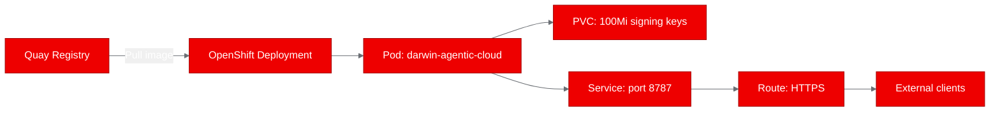

## What is Darwin Agentic Cloud?

Darwin Agentic Cloud is a verifiable compute platform that gives AI agents cryptographic proof of what they've done. Every computation an agent performs gets signed with Ed25519 keys, producing an attestation certificate that anyone can independently verify. The platform exposes this through a FastAPI server, an MCP interface for tool-calling agents, and a Docker-based sandbox for isolated execution.

The core idea is straightforward: as autonomous agents start handling real work (filing taxes, managing infrastructure, executing trades), you need a tamper-proof record of what happened. Darwin provides that record.

## Why it matters for Red Hat OpenShift AI

AI governance isn't optional anymore. Organizations deploying agentic workloads on Red Hat OpenShift AI need answers to hard questions: Can we prove an agent did what it claims? Can we audit every step? Can we satisfy compliance requirements?

Darwin slots directly into this picture. It provides the attestation layer that sits between your agents and the systems they operate on. Running it on OpenShift AI means you get Red Hat's security model (SELinux, non-root containers, network policies) wrapped around a cryptographic audit trail. That's a strong foundation for regulated industries where "trust but verify" isn't enough.

The platform also speaks MCP (Model Context Protocol), which means any MCP-compatible agent framework can call Darwin's signing and verification tools natively. That's relevant for teams building agent pipelines on OpenShift AI who need attestation without bolting on a separate service.

## Containerizing for OpenShift

Darwin ships with its own Dockerfile, but it assumes root access and a writable `/data` directory. OpenShift runs containers with a random UID and a read-only filesystem by default. We had to fix that.

We built a UBI9-based container image using `registry.access.redhat.com/ubi9/python-312` as the base. The key changes:

```dockerfile
FROM registry.access.redhat.com/ubi9/python-312

COPY requirements.txt .
RUN pip install --no-cache-dir -r requirements.txt

COPY . .

ENV DARWIN_CLASS_KEYS_DIR=/opt/app-root/data/class-keys
RUN mkdir -p /opt/app-root/data/class-keys && \
    chmod -R g+rwX /opt/app-root/data

EXPOSE 8787
CMD ["uvicorn", "app.main:app", "--host", "0.0.0.0", "--port", "8787"]
```

The critical fix was redirecting `DARWIN_CLASS_KEYS_DIR` to `/opt/app-root/data/class-keys`. The original entrypoint script tried writing signing keys to `/data`, which fails under OpenShift's security context constraints. By placing key storage under `/opt/app-root/data` and setting group write permissions, the container works with any UID that OpenShift assigns.

We pushed the image to `quay.io/aicatalyst/darwin-agentic-cloud:latest`.

## Deploying to the cluster

The deployment targets a dedicated namespace `poc-darwin-agentic-cloud` with resource limits sized for a lightweight API service.



The Kubernetes manifests include:

- **Deployment**: Single replica, 256Mi-512Mi RAM, 250m-500m CPU, liveness probe on `/healthz`
- **PersistentVolumeClaim**: 100Mi volume mounted at `/opt/app-root/data` for Ed25519 signing key persistence across pod restarts
- **Service**: ClusterIP on port 8787
- **Route**: TLS-terminated edge route for external access

The PVC is essential here. Darwin generates its signing keypair on first boot. Without persistent storage, every pod restart would generate a new identity, breaking any previously issued attestation certificates.

## Running validation tests

We ran four test scenarios against the live deployment. All four passed.

| Test | Endpoint | What we checked | Result |
|------|----------|----------------|--------|
| health-check | `/healthz` | Returns `{"status":"ok"}` | PASS |
| identity-endpoint | `/v0/identity` | Returns `key_id`, `public_key_b64`, `substrate_id` | PASS |
| demo-page | `/demo` | Renders HTML attestation certificate | PASS |
| swagger-docs | `/docs/swagger` | Renders Swagger UI with all endpoints | PASS |

The identity endpoint is the most telling. It confirms Darwin generated its Ed25519 keypair successfully and can serve the public key for verification. The demo page renders a full attestation certificate in HTML, showing the signing flow works end to end.

## What we learned

**Non-root filesystem is the biggest hurdle.** Darwin's upstream code assumes a root-writable `/data` directory in multiple places. The `docker-entrypoint.sh` script, the default config, and the key generation logic all point there. We solved it with a single environment variable override (`DARWIN_CLASS_KEYS_DIR`), but only after tracing through the startup sequence to find where the path was configurable.

**Not all features translate to Kubernetes.** Darwin's `/v0/run` endpoint executes code inside a Docker container, which requires access to the Docker socket. That's a non-starter on OpenShift, where pods don't get access to the container runtime. This isn't a blocker for the attestation use case (signing and verification work fine), but it means the sandbox execution feature needs a different approach on Kubernetes. Options include Tekton pipelines, OpenShift Pipelines, or a sidecar model with Podman.

**Quay authentication has a quirk.** Pushing to Quay.io with robot accounts requires the username format `$oauthtoken` (literal dollar sign included). We hit authentication failures until we switched to this format. Small detail, easy to miss.

**PVC sizing matters for key management.** We allocated 100Mi for the signing key PVC. In production, you'd want to consider key rotation policies and how many class keys the platform accumulates over time. For a PoC, 100Mi is plenty.

## Try it yourself

The fork with all OpenShift modifications is at [github.com/aicatalyst-team/darwin-agentic-cloud](https://github.com/aicatalyst-team/darwin-agentic-cloud). The container image is public at `quay.io/aicatalyst/darwin-agentic-cloud:latest`.

To reproduce this deployment:

```bash
# Create namespace
oc new-project poc-darwin-agentic-cloud

# Apply manifests (Deployment, Service, Route, PVC)
oc apply -f k8s/

# Verify
curl -s "$(oc get route darwin-agentic-cloud -o jsonpath='{.spec.host}')/healthz"
# {"status":"ok"}

# Check identity
curl -s "$(oc get route darwin-agentic-cloud -o jsonpath='{.spec.host}')/v0/identity" | python -m json.tool
```

The original project is Apache-2.0 licensed at [github.com/vje013/darwin-agentic-cloud](https://github.com/vje013/darwin-agentic-cloud). If you're building agentic workloads on OpenShift AI and need cryptographic attestation, Darwin is worth evaluating. The attestation and identity endpoints work cleanly in a Kubernetes environment; the sandbox execution piece needs adaptation, but the core value proposition holds.
