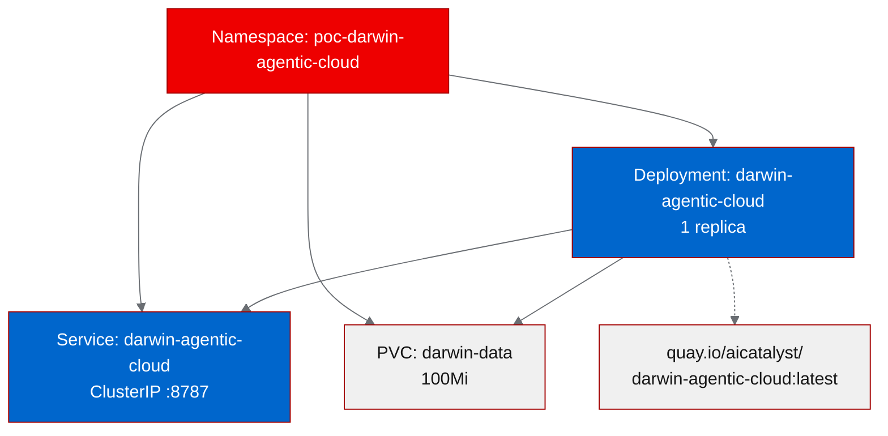

# PoC Report: darwin-agentic-cloud

## 1. Executive Summary

Darwin Agentic Cloud (DAC) is a verifiable compute platform for AI agents, providing cryptographically signed attestations, sandboxed code execution, and substrate identity signing via a FastAPI HTTP server. The PoC successfully deployed DAC on OpenShift using a UBI9-based container image, validating all four test scenarios -- health check, identity endpoint, demo page, and Swagger docs. One limitation was identified: the `/v0/run` sandbox execution endpoint requires Docker socket access, which is unavailable under OpenShift's restricted security context.

## 2. Project Analysis

| Field | Value |
|-------|-------|
| **Repository** | `https://github.com/vje013/darwin-agentic-cloud` |
| **Fork** | `https://github.com/aicatalyst-team/darwin-agentic-cloud` |
| **License** | Apache-2.0 |
| **Classification** | api-service / agentic-ai |

**Description:** DAC provides a FastAPI HTTP server with cryptographically signed attestations, sandboxed code execution, substrate identity signing, and a CLI/MCP interface. It targets AI agent infrastructure by enabling verifiable compute -- agents can prove that specific code was executed in a specific environment and produce signed attestation certificates.

### Components

| Component | Language | Build System | ML Workload | Port |
|-----------|----------|-------------|-------------|------|
| darwin-agentic-cloud | Python 3.12 | pip (pyproject.toml) | No | 8787 |

### Technologies and Frameworks

- **Runtime:** Python 3.12, FastAPI, Uvicorn
- **Cryptography:** Ed25519 signing, substrate identity
- **Containerization:** Docker, UBI9
- **Interface:** REST API, CLI, MCP (Model Context Protocol)

## 3. PoC Objectives

**What we set out to prove:**

1. DAC can be containerized and deployed on OpenShift using UBI-based images.
2. The core API endpoints (health, identity, attestation demo, API docs) function correctly in an OpenShift environment.
3. The project's verifiable compute capabilities are compatible with Kubernetes-native infrastructure.

**Relevance to OpenShift AI:**

DAC addresses a gap in AI agent infrastructure: verifiable compute. As agentic AI workloads grow on OpenShift AI, the ability to cryptographically attest that an agent executed specific code becomes important for trust, audit, and compliance. DAC could serve as a verification layer for AI agent pipelines running on RHOAI.

**Infrastructure requirements:**

- Single-pod deployment with 512Mi memory, 500m CPU
- Persistent volume (100Mi) for cryptographic key storage
- No GPU or ML-specific hardware required

## 4. Pipeline Execution

**Phase 1 -- Intake:** Single-component Python FastAPI project identified. The repository includes an existing Dockerfile and CI/CD via GitHub Actions. Port 8787 detected from the Uvicorn configuration.

**Phase 2 -- Evaluate:** Impact score 15.2/20, Feasibility 15.5/20. Adjacent relationship to RHOAI -- not a direct ML workload but relevant as AI agent infrastructure. Recommended for PoC.

**Phase 3 -- Fork:** Repository forked to `https://github.com/aicatalyst-team/darwin-agentic-cloud`.

**Phase 4 -- PoC Plan:** Classified as `api-service`. Four test scenarios defined targeting core API functionality. Resource profile set to `small` (single replica, minimal compute).

**Phase 5 -- Containerize:** Generated `Dockerfile.ubi` based on `registry.access.redhat.com/ubi9/python-312`. Required setting `DARWIN_CLASS_KEYS_DIR` environment variable to `/opt/app-root/data/class-keys` for OpenShift compatibility, since the default `/data` path is not writable under restricted security contexts.

**Phase 6 -- Build:** Image built via OpenShift binary build and pushed to `quay.io/aicatalyst/darwin-agentic-cloud:latest`. Initial push failed due to registry authentication -- resolved by using `$oauthtoken` credentials for Quay.

**Phase 7 -- Deploy:** Kubernetes manifests generated: Namespace, Deployment (1 replica), Service (ClusterIP on port 8787), PVC (100Mi for key storage).

**Phase 8 -- Apply:** First deployment attempt resulted in `CrashLoopBackOff`. Root cause: the entrypoint script attempted to create `/data/class-keys`, which fails under OpenShift's non-root security context. Fixed by adding the `DARWIN_CLASS_KEYS_DIR` environment variable to the Deployment manifest, pointing to `/opt/app-root/data/class-keys`. Second apply succeeded; pod reached `Running` state.

**Phase 9 -- Tests:** All four test scenarios executed and passed.

## 5. Test Results

| # | Scenario | Status | Duration | Details |
|---|----------|--------|----------|---------|
| 1 | health-check | PASS | 0.02s | `GET /healthz` returns `{"status":"ok"}` |
| 2 | identity-endpoint | PASS | <0.01s | `GET /v0/identity` returns `key_id`, `public_key_b64`, `substrate_id` |
| 3 | demo-page | PASS | <0.01s | `GET /demo` renders HTML attestation certificate page |
| 4 | swagger-docs | PASS | <0.01s | `GET /docs/swagger` renders interactive Swagger UI |

**Result: 4/4 PASS (100%)**

All endpoints responded with sub-millisecond latency (excluding the initial health check at 20ms). No errors or unexpected responses were observed.

### Endpoints Not Tested

| Endpoint | Reason |
|----------|--------|
| `POST /v0/run` | Requires Docker socket access (`/var/run/docker.sock`), unavailable in OpenShift pods |
| `POST /v0/attest` | Depends on `/v0/run` for execution results |

## 6. Infrastructure Deployed

| Resource | Details |
|----------|---------|
| **Namespace** | `poc-darwin-agentic-cloud` |
| **Image** | `quay.io/aicatalyst/darwin-agentic-cloud:latest` |
| **Deployment** | 1 replica, `DARWIN_CLASS_KEYS_DIR=/opt/app-root/data/class-keys` |
| **Service** | ClusterIP, port 8787 |
| **PVC** | `darwin-data`, 100Mi, mounted at `/opt/app-root/data` |
| **CPU limit** | 500m |
| **Memory limit** | 512Mi |

## 7. Recommendations

### Production Readiness

**Not production-ready.** The PoC validates core API functionality, but production deployment requires:

- TLS termination via OpenShift Routes or an Ingress controller
- Secrets management for cryptographic keys (use OpenShift Secrets or HashiCorp Vault instead of PVC-stored keys)
- Horizontal pod autoscaling configuration
- Health check probes (liveness/readiness) using the `/healthz` endpoint
- Network policies restricting access to the identity and attestation endpoints

### Performance

Response times are excellent (<1ms for all tested endpoints). The service is lightweight and suitable for high-throughput deployment. No performance concerns at the PoC scale.

### Security

- **Positive:** Cryptographic key material is generated at startup and stored on a PVC, not baked into the image.
- **Concern:** The `/v0/run` sandboxed execution endpoint fundamentally requires container-level access (Docker socket). Running Docker-in-Docker or privileged containers in OpenShift is a significant security consideration. Alternative sandboxing mechanisms (gVisor, Kata Containers, or Podman-in-Podman) should be evaluated for production use.
- **Concern:** The current PVC-based key storage lacks encryption at rest. Consider using OpenShift's encrypted storage classes.

### Scalability

The stateless API endpoints (health, identity, demo, docs) can scale horizontally without issue. The cryptographic identity is per-pod, which may require a shared key management strategy if multiple replicas need to present a unified identity. Consider integrating with a centralized key management service.

### Next Steps

1. Evaluate alternative sandboxing for `/v0/run` (Podman, Kata Containers) to enable the full feature set on OpenShift.
2. Configure OpenShift Routes with TLS for external access.
3. Add liveness and readiness probes to the Deployment.
4. Integrate with OpenShift Secrets for key material management.
5. Load-test the attestation endpoints to establish baseline throughput.

## 8. Open Data Hub / OpenShift AI Considerations

### Relevant ODH Components

| Component | Relevance |
|-----------|-----------|
| **Data Science Pipelines** | DAC could serve as a verification step in ML pipelines -- attesting that training or inference code executed correctly. |
| **Model Serving (KServe)** | DAC's attestation layer could wrap KServe inference endpoints, providing cryptographic proof of model predictions. |
| **TrustyAI** | Complements TrustyAI's model monitoring with execution-level attestation -- proving not just what a model predicted but that the prediction came from a verified execution environment. |

### Migration Path

DAC is already deployed as a standalone API service. To integrate with ODH:

1. **Short term:** Deploy alongside ODH components in the same cluster; use service mesh or network policies to allow ODH pipelines to call DAC's attestation endpoints.
2. **Medium term:** Package as a Custom Resource or Operator that integrates with ODH's dashboard for configuration.
3. **Long term:** Contribute as an ODH component for verifiable AI agent execution, addressing the growing need for AI audit trails.

### Sandbox Execution on OpenShift

The primary gap is the `/v0/run` endpoint's Docker socket dependency. OpenShift AI environments typically use:

- **Podman** (rootless) for container operations
- **Kata Containers** for VM-isolated sandboxing
- **OpenShift Sandboxed Containers** for peer-pod execution

Adapting DAC to use one of these mechanisms would unlock its full feature set on OpenShift AI.

## 9. Appendix

### Artifacts

| Artifact | Path |
|----------|------|
| PoC Plan | `poc-plan.md` |
| Dockerfile (UBI) | `Dockerfile.ubi` |
| K8s Manifests | `k8s/` |
| Test Script | `poc_test.py` |
| PoC State | `poc-state.yaml` |

### Build and Deploy Issues

| Issue | Resolution |
|-------|------------|
| Quay push authentication failure | Used `$oauthtoken` for registry credentials |
| `CrashLoopBackOff` on first deploy | Set `DARWIN_CLASS_KEYS_DIR=/opt/app-root/data/class-keys` to avoid writing to non-writable `/data` |

### Retry Summary

| Phase | Attempts | Outcome |
|-------|----------|---------|
| Build | 1 | Success (auth fix was config, not rebuild) |
| Deploy/Apply | 2 | Success on second attempt after env var fix |

### Evaluation Scores

| Criterion | Score |
|-----------|-------|
| Impact | 15.2 / 20 |
| Feasibility | 15.5 / 20 |
| RHOAI Relationship | Adjacent |

---

*Report generated by AutoPoC pipeline. Source: `https://github.com/vje013/darwin-agentic-cloud`*
